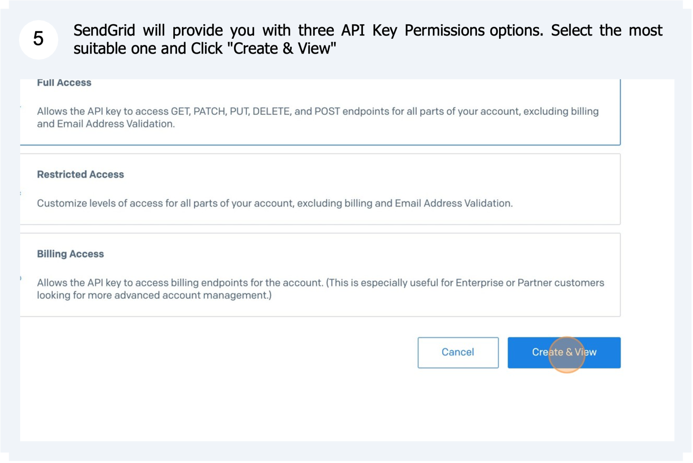

# SendGrid API Key generation

Why are API Keys needed?

Rapid Platform can use API (Application Programming Interface) keys to authenticate access to SendGrid services. They are the preferred alternative to usin ga username and password because you can revoke an API key at any time without having to change the source system (aka: Rapid) or altering your login details.

Here Rapid uses these credentials to communicate with your SendGrid instance to fetch your templates and authorised senders.

To generate the API key in SendGrid before adding it to your Rapid site:

