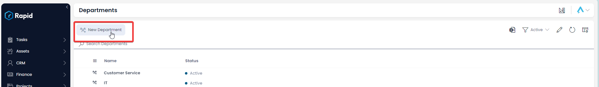
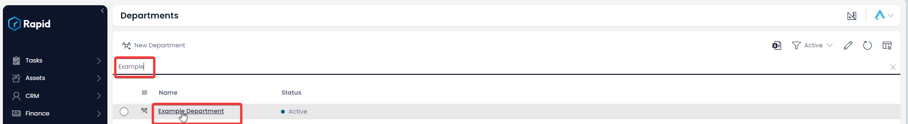
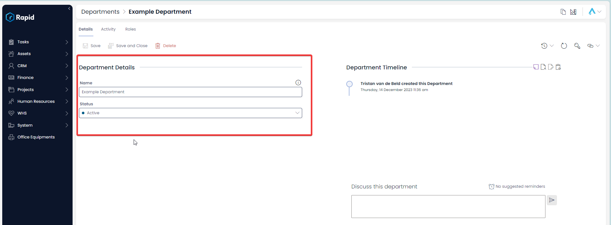
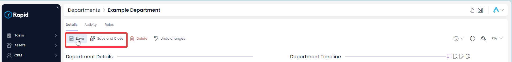
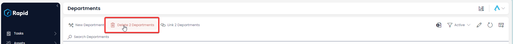
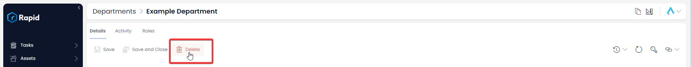

# Creating, Editing, and Deleting Departments

### How to create a new Department

1. Navigate to Human Resources &gt; Departments  
    
2. Select **New Department** 
3. Enter a **Name** and ****Status**** 
4. Select **Create** or ****Create and Open**** 

### How to edit a department

1. Navigate to Human Resources &gt; Departments  
    
2. Open the desired department item. (Locate the department by either scrolling through the list or using the search)  
    
3. Edit the fields as required  
    
4. Press **Save** or ****Save and Close**** 

### Deleting Departments

It is not recommended to delete a department instead, change its status to **Archived**. This way you can maintain a record of past and current departments.

However, if you need to delete a department due to incorrect data entry or a duplicate entry, you can do so in two ways: from the list or from the item page. Deleting from the list allows you to delete multiple departments at once.

#### How to Delete Multiple Departments from the List page

1. Navigate to Human Resources &gt; Departments  
    
2. Select the departments you want to delete  
    
3. Press **Delete X Departments** 

#### How to Delete a single Department from the item page

1. Navigate to Human Resources &gt; Departments  
    
2. Open the desired department item. (Locate the department by either scrolling through the list or using the search)  
    
3. Select **Delete** 