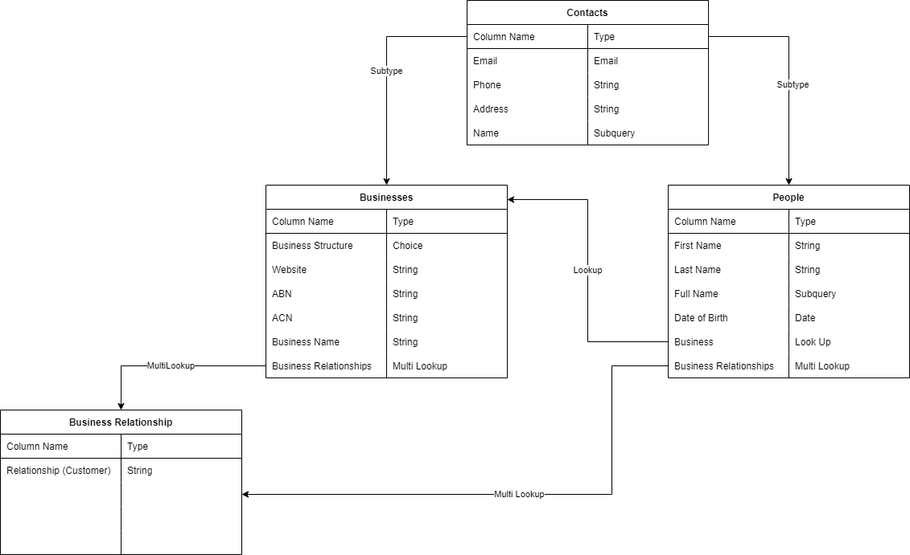
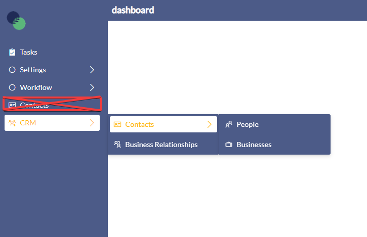

# CRM Bundle

### Purpose

This bundle provides users with a data structure to track customers, employees, and suppliers. It also has the capability to be expanded to encompass any other type of relationship between the home business (the business that the rapid site represents) and any other business / people.

### Data Structure

The bundle includes the following tables: Contacts, Businesses, People, and Business Relationships. Businesses and People are Subtypes of contacts. This allows for all company contacts to be viewed and filtered on a single table. The relationships between these tables can be distinguished in the diagram below.

### Bundle Installation

1. Download the Contacts bundle [here](https://simpliltd-my.sharepoint.com/:u:/g/personal/tristan_vdb_simpli_org/EUqG_bsEkZJEiYlKB3ChYFcBdaNgNbnJ4J0WlSS0JqqNJA?e=FixaPy) and install it by going to settings &gt; advanced &gt; bundles &gt; add bundles &gt; upload.
2. Download the CRMBundleV2 [here](https://simpliltd-my.sharepoint.com/:u:/g/personal/tristan_vdb_simpli_org/EZGezI60GO5MkVj6RRp3LSEBF6VWWTe53y4a5gsSB021gA?e=Nyourq) and install it as per step 1
3. Remove the additional link to the contacts table on the explorer sidebar 
4. Open the Contacts table in designer and add the "Name" field to the design form
5. Open the People table and create a look up column called "Business" looking up to the businesses table