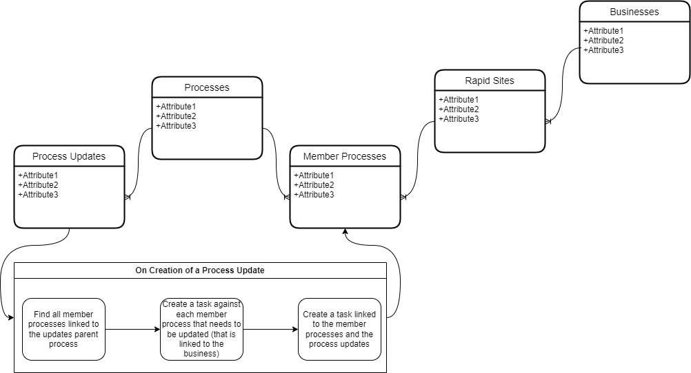

# Process Update Process (PUP)

The purpose of the Process Update Process (PUP) is to allow Simpli consultants to track changes on the "master" process and be able to see which Simpli members have this process on their sites. This means that if the master process is updated, a Simpli consultant can easily identify which sites they need to go to in order to manually update the process for the member.

To ensure that this process works effectively, the following guidelines must be adhered to:

1. If a 'master' process is modified, this modification needs to be added to the "Process Updates" table.
2. This will then create a task for each implementation of the process for the sites consultant to manually update this. In some situations, the member may have modified it too much from the original for the change to be made. This is up to the discretion of the consultant.

Another point to note is that each Simpli member (represented on the businesses table below) will have their site details recorded on the Rapid sites table (as they could possibly have multiple sites, such as production and test sites).

Below is a diagram showing the entity relationships:

