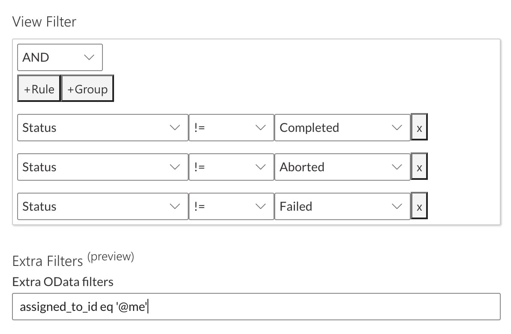

# OData Filters

When using the view extra filters these tokens are available

- @me
- @startOfQuarter
- @endOfQuarter
- @startOfMonth
- @endOfMonth
- @startOfWeek
- @endOfWeek
- @today
- @tomorrow

For example

