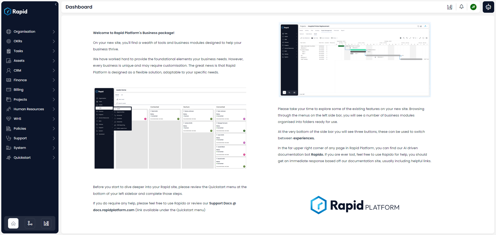

# Dashboard

Opening your site will send you to the site's **Dashboard** page. This is simply a landing page, and is the first thing you will see when logging into your site.

By default, the **Rapid Business** dashboard will contain a welcome screen from Rapid, whereas a **Blank Rapid** site will contain a blank dashboard page.

> The dashboard, as seen on a new **Rapid Business** site.

:::note[Editing the Dashboard]
It is worth noting that in a later training package, we will discuss how to edit a page using the **Designer** experience.

This means you can change the dashboard to suit your business needs, which we will discuss in a later training package.
:::