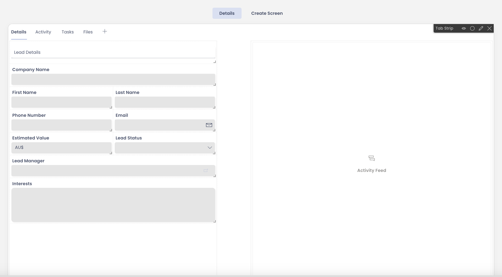

# Activity - Configure Item Details and Create Screen

In the previous activity you had created a Table for the Sales Manager of your organisation - Stationary Inc.

Now it is time to create the infrastructure to help Sales Team to record and view data into the Data Table. You need to:

1) Provide a form which the Sales Team can use to record Lead's information.
2) Configure the page which will display the details of the recorded Lead(s).

  
  **HINT**

You can create the Item Details as shown below:

  
Similarly, you can configure the Create Screen breakpoint as shown below:

  
  In achieving the above, you will need to:

1) Goto the Leads Details Table created in previous activity in Designer.
2) Goto Details Tab
3) Navigate to Singular set
4) In Details breakpoint, add required fields to the form component.
5) Add Label to the form component. 
6) Resize and reposition the fields as needed.
7) Click Save.

Similarly, go to Create Screen and resize / reposition fields as needed. 
Click Save.